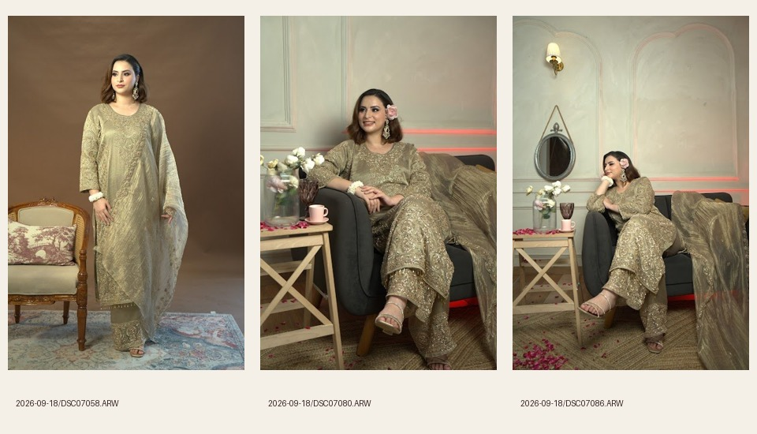

# Media plan and visual asset map

Verified public Drive inventory: **255 files, 141 ARW stills and 114 MP4 clips**, in the two supplied September shoot folders. All 255 previews were obtained and reviewed in 11 labelled contact sheets. Three selected videos were downloaded and sampled at 20%, 50% and 80% with timestamps. Fourteen selected stills were decoded from full Sony RAW files, including matching originals already in the supplied local Downloads folder. No generated or stock garment imagery.

Open [the visual asset map](docs/asset-map.html) for side-by-side thumbnails and roles. [The manifest](public/media/manifest.json) records original path, Drive ID, dimensions, processing and byte sizes. Contact sheets are in docs/contact-sheets; original inventory is docs/drive-inventory.json.

## Processing and delivery

LibRaw/rawpy camera white balance and sRGB, with auto exposure; no warm colour filter, hue changes, retouching of clothing or embroidery synthesis. Source photographs are 4024×6024. Responsive derivatives use AVIF and WebP at 320, 480, 640, 800, 1080, 1600 and 2400 pixels, plus a 1600px JPEG fallback. Explicit dimensions reserve space; native picture sources choose resolution. Below-fold photography is lazy loaded. Originals stay outside public/. An output-size inventory is included in the manifest.

## Motion

2026-09-18/C0094.MP4, 19.68 seconds, supplies the olive-gold product film. The selected portion starts at 3.0 seconds and lasts 8 seconds. Rotated counter-clockwise to restore the camera's intended portrait orientation, scaled to 720×1280, H.264, CRF 24, no audio, faststart. Public output: `/media/olive-motion.mp4` (3.2 MB), with `/media/olive-motion-poster.webp`. It loads only on request, uses controls and does not autoplay. The original is not bundled.

### Home page motion, added 21 September 2026

Three real Drive clips now appear on the homepage. All retain their full portrait framing, original colour and 25fps motion, with audio removed. Each has 480px and 720px H.264 CRF26 faststart exports and a frame-matched WebP poster. Reproduce with `.venv/bin/python scripts/export-video.py`. Source IDs, trims and exact output bytes are in [video-manifest.json](public/media/video-manifest.json).

| Placement | Source and trim | Phone / desktop bytes |
|---|---|---|
| Opening, olive-gold suit | C0094, 10.5s to 18.5s | 1,143,428 / 2,373,782 |
| Current edit, fuchsia | C0028, 1s to 7s | 1,215,487 / 2,159,878 |
| Closer look, seated dupatta | C0104, 0.3s to 4.8s | 647,815 / 1,336,995 |

The hero poster is eager and high priority. Video sources attach only after page load and when at least 20% of the frame is visible. Below-fold films are not requested at initial load. Viewports below 768px, and placements at most 320px wide, use 480px exports. Playback is silent and inline, with a visible keyboard-accessible play/pause control. Offscreen and hidden-tab playback pauses; manual pause persists when returning. Reduced-motion, Save-Data and reported 2G connections default to stills without requesting MP4s, with explicit play available. Failed video preserves the poster and ordering links. A browser that blocks autoplay leaves the play button available. No-JavaScript rendering retains the still.

These are garment films, not footage of the making process. The films are presented as silent garment imagery with text descriptions; no voiceover, music or instructions are added. The earlier on-request olive-gold product film remains available with native controls.

## Matching and meaningful gaps

The final galleries contain three visually matched outfits: fuchsia, blue and olive-gold. Clothing colour, neckline, repeated motifs, dupatta and trouser treatment were compared across selected frames. Descriptive colour names are not claimed to be official product names. No uncertain cross-outfit matches are included.

No verified lehenga, workshop, maker-at-work or customer-worn images were identified. Lehengas use a clearly described custom-enquiry page without a fabricated image. The Atelier page identifies its image as an outfit from the edit. No material-composition or handwork inference is made from the images. Confirm fabric, technique, prices, available options and timing with the business.

## Unused strong still candidates

- DSC07058: alternate full olive-gold silhouette. DSC07053 has a more open pose and was preferred for the campaign.
- DSC07080: seated olive-gold lifestyle portrait. Strong alternate, but the red background light adds a competing colour.
- DSC07086: wider seated lifestyle composition with dupatta. Useful for a later story; DSC07085 already provides this setting in Journal.

These are selection previews only, not public storefront images.

## Still selections

| Source | Role | Crop | Output |
|---|---|---|---|
| [2026-09-17/DSC06962.ARW](https://drive.google.com/file/d/1xh9U6XbTEqXaNfJ3EKqtYmNiF5A3dOp7/view) | Fuchsia product gallery: border and hem | Full portrait in gallery on both sizes. | `/media/dsc06962-{width}.{avif,webp}` |
| [2026-09-17/DSC06963.ARW](https://drive.google.com/file/d/1Tjm8JUVsLAggoBZPxpKYggRHoBQNicPh/view) | Collection index; Fuchsia gallery; Atelier | Gallery retains full frame; index 4:5 desktop, 80×112 phone, focal 50% 40%. | `/media/dsc06963-{width}.{avif,webp}` |
| [2026-09-17/DSC06967.ARW](https://drive.google.com/file/d/18av2qhhqCixB3B8k_GLB7iD7vwT2jWyg/view) | Collection listing; Fuchsia gallery; related looks (homepage now uses C0028) | 4:5 editorial crop at 50% 65%; gallery full 2:3 portrait. Hem retained. | `/media/dsc06967-{width}.{avif,webp}` |
| [2026-09-17/DSC06973.ARW](https://drive.google.com/file/d/1OEklGYDr8yz9-Cvkzob7eNtX9OvWfXM0/view) | Fuchsia gallery: neckline and cuff | Full portrait, no decorative overlay. | `/media/dsc06973-{width}.{avif,webp}` |
| [2026-09-18/DSC07018.ARW](https://drive.google.com/file/d/1SsSOnypk7ny3MqlQmOgol3q1j8VdQyfj/view) | Blue gallery: seated drape | Full portrait at all widths. | `/media/dsc07018-{width}.{avif,webp}` |
| [2026-09-18/DSC07024.ARW](https://drive.google.com/file/d/1mAzCxYCVfg8n2UkpeySCByeQ7diR-0ix/view) | Blue gallery and Journal whole-outfit article: embroidery detail | Full portrait at all widths. | `/media/dsc07024-{width}.{avif,webp}` |
| [2026-09-18/DSC07025.ARW](https://drive.google.com/file/d/1duagE0AF1LzFMdO_DWYwK2nzHC69X_QL/view) | Home current edit; Blue gallery; listings; related looks | 3:4 editorial at 50% 48%; gallery full portrait; Journal 4:5. | `/media/dsc07025-{width}.{avif,webp}` |
| [2026-09-18/DSC07041.ARW](https://drive.google.com/file/d/1SZ6yDDeji-SAgTFw1ge4qgMM4e5sZMiS/view) | Olive-gold gallery (homepage now uses C0104) | 2:3 portrait on both sizes. | `/media/dsc07041-{width}.{avif,webp}` |
| [2026-09-18/DSC07046.ARW](https://drive.google.com/file/d/1nugTdwyfoYtXsn3UPsvRNVpQPkwCRsxB/view) | Olive-gold gallery (homepage now uses C0104) | Desktop fills detail chapter; phone 440px-high crop at 50% 30%; gallery full portrait. | `/media/dsc07046-{width}.{avif,webp}` |
| [2026-09-18/DSC07051.ARW](https://drive.google.com/file/d/1tN7LkC0-REL-gaAhqd_ZVQY4X9MfljuX/view) | Wedding wear collection-index preview | 4:5 preview on desktop; narrow visible mobile thumbnail. | `/media/dsc07051-{width}.{avif,webp}` |
| [2026-09-18/DSC07053.ARW](https://drive.google.com/file/d/1KGvh73MVI8DUc-0WbSQYJDkuaAWgQZoG/view) | Olive-gold gallery; listings; typography studies (homepage now uses C0094) | 2:3 hero on phone; near-original portrait on desktop. Gallery full portrait. | `/media/dsc07053-{width}.{avif,webp}` |
| [2026-09-18/DSC07072.ARW](https://drive.google.com/file/d/1IN7OhrHLdeeCagz3EctkZJXtomRRb8Kk/view) | Custom opening | 3:4 Custom crop; article 4:3 desktop, 4:5 mobile, focus 50% 38%. | `/media/dsc07072-{width}.{avif,webp}` |
| [2026-09-18/DSC07085.ARW](https://drive.google.com/file/d/12GCfbenwNtMdGmKrzH4JrVAi9HO9vN6w/view) | Journal first-conversation article and listing | Listing 4:5; article 4:3 desktop and 4:5 phone, focus 50% 38%. | `/media/dsc07085-{width}.{avif,webp}` |
| [2026-09-18/DSC07089.ARW](https://drive.google.com/file/d/10oxnA_yEMLv92uiPQKC4ZpGkeOl6VKia/view) | Home opening detail; Olive-gold gallery | Narrow hero detail at 48% 50%, upper two-thirds of companion column. Gallery full portrait. | `/media/dsc07089-{width}.{avif,webp}` |
